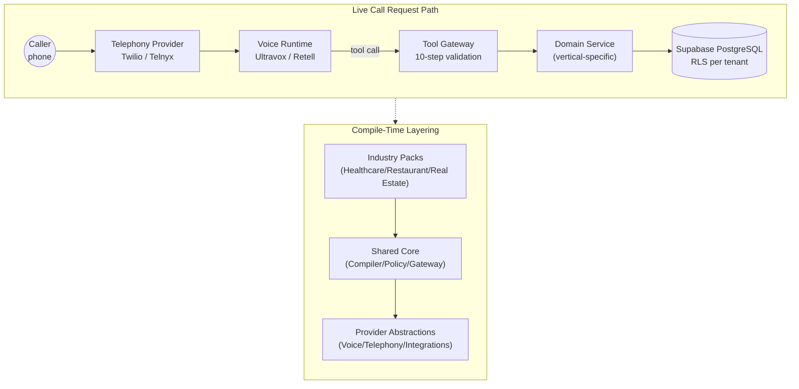

# VerticalVoice AI

**Multi-tenant B2B SaaS platform providing AI voice calling agents for inbound and outbound customer engagement across healthcare, restaurants, and real estate.**

[](https://github.com/alifakhar816/verticalvoice-ai/actions)
[](LICENSE)
[](https://nextjs.org/)
[](https://www.typescriptlang.org/)
[](https://supabase.com/)

---

## Live Demo

**Try VerticalVoice AI now:** [https://verticalvoice.alphaos.tech](https://verticalvoice.alphaos.tech)

The platform is live with real voice traffic and supports healthcare, restaurant, and real estate verticals. Use the onboarding wizard to configure an AI agent in minutes.

---

## The Problem

Businesses dependent on inbound phone contact face three endemic challenges:

1. **Missed calls = lost revenue.** A call centre agent who is unavailable or buried in other work misses inbound leads, appointment requests, and customer inquiries. Every missed call is revenue forfeited.

2. **Front-desk coverage is expensive and hard to scale.** Hiring, training, and retaining receptionist and support staff is a fixed cost that grows with call volume. Scheduling coverage across time zones compounds the problem.

3. **Industry compliance requires expertise.** Healthcare clinics must protect patient data and handle emergencies; restaurants must track allergies and manage capacity; real estate firms must avoid discrimination in lead qualification. Non-compliance is costly; building these guardrails in-house is slow.

VerticalVoice AI addresses this by deploying an AI receptionist tailored to a specific industry. It answers concurrent inbound calls without queueing and enforces industry compliance rules deterministically — compiled from the industry pack rather than left to model judgement. Per-tenant operating hours are configurable and stored, though enforcement against booking requests is not yet wired (see [known limitations](docs/compliance/known-limitations.md)).

---

## What It Does

### Agent Configuration & Lifecycle

- **Guided onboarding wizard** — 10-step setup flow; tenants select industry, configure business profile, choose voice/persona, and activate live in minutes.
- **Versioned agent configs** — compile, activate, and rollback agent configurations deterministically; no ambiguity about which prompt is live.
- **Config-driven compilation** — business profile + industry pack + knowledge base → deterministic agent prompt and tool set (no LLM-decided policy).

### Inbound Call Handling

- **Full call lifecycle** — inbound call routing, speech recognition, conversational turn-taking, tool invocation, and post-call summarization.
- **Multi-provider voice runtime** — Ultravox (primary, optimized for latency) + Retell (fallback). Mock provider for local dev.
- **Multi-provider telephony** — Twilio (primary) + Telnyx (cost-optimized) + Plivo. Mock provider for local dev.
- **WebRTC browser calling** — test calls directly from the dashboard.

### Industry-Specific Capabilities

#### Healthcare
- Appointment booking with Google Calendar integration.
- EHR integration layer with a defined adapter interface; a demo adapter is implemented, production connectors (Epic, Cerner) are not yet built.
- Patient intake and refill request handling.
- Emergency protocol execution (transfer to on-call, 911 escalation).
- PHI/PII redaction on all recordings and transcripts.
- HIPAA-aware consent and retention policies.

#### Restaurant
- Real-time order placement with POS integration (Square).
- Reservation and waitlist management.
- Allergen and dietary restriction capture.
- Complaint escalation and callback routing.
- No card data collected or stored by agent (delegated to POS).

#### Real Estate
- Lead qualification and pre-showing triage.
- Showing scheduling with agent calendar.
- Property detail lookup and comparison.
- Fair Housing Act compliance (anti-discrimination rules, protected-class detection).
- Lead assignment and nurture workflows.

### Intelligence & Analytics

- **Post-call analysis** — automatic transcript, summary, and outcome classification.
- **Call evaluation framework** — assess agent performance on latency, tone, accuracy, and compliance.
- **Usage and ROI tracking** — dashboards showing call volume, resolution rate, cost per call, and revenue impact.
- **Audit trail** — immutable log of all configuration changes, call events, and tool executions (compliance-friendly).

### Knowledge & Integration

- **Knowledge source ingestion** — upload documents, PDFs, or scrape websites; platform extracts facts and chunks.
- **Fact extraction and review** — AI-extracted knowledge facts are reviewed before live use.
- **Third-party integrations** — Google Calendar, Square POS, HubSpot CRM, Resend email.
- **Outbound calling** — place outbound campaigns from contact lists; DNC and suppression list enforcement.

### Compliance & Safety

- **Deterministic policy engine** — healthcare/restaurant/real-estate policies are compiled, not LLM-decided.
- **DNC (Do Not Call) enforcement** — outbound calls check national and custom suppression lists.
- **Recording consent versioning** — track consent state per call; support multiple recording consent models.
- **GDPR & privacy** — subject data export and erasure endpoints; call retention policies.
- **Redaction rules** — PII/PHI patterns (SSN, card numbers, medical terms) redacted from all outputs.

---

## Architecture

The platform separates the **shared core** (compiler, policy engine, tool gateway) from **pluggable industry packs**. This allows three very different businesses to be served by one system instead of three separate codebases.



**Key design decision**: Every industry implements the same `IndustryPack` interface. The compiler, policy engine, and tool gateway never branch on industry type — vertical-specific behavior lives entirely inside the pack. This keeps healthcare HIPAA logic, restaurant allergen logic, and real estate Fair Housing logic isolated.

Learn more:
- [ADR-001: Vertical Pack Architecture](docs/architecture/ADR-001-vertical-pack-architecture.md) — decision rationale and trade-offs.
- [System Architecture Diagram](docs/project/architecture-diagram.md) — detailed Mermaid flows with request paths.
- [Architecture Inventory](docs/architecture/INVENTORY.md) — technology stack, database schema, file structure.

---

## Tech Stack & Rationale

| Layer | Technology | Why? |
|---|---|---|
| **Framework** | Next.js 16 + React 19 | Unified codebase for dashboard, public site, and API routes. React 19 for better concurrent features. |
| **Language** | TypeScript (strict mode) | Type safety at compile-time; zero `any` escapes across 261 source files. |
| **Database** | Supabase PostgreSQL | Row-Level Security (RLS) enforces multi-tenant isolation at the database layer, not app code. SSH managed authentication. |
| **Voice** | Ultravox (primary) | Sub-second latency; streaming speech-to-text; natural conversational flow. |
| **Voice** | Retell (fallback) | Vendor diversification; fallback if Ultravox is unavailable. |
| **Telephony** | Twilio (primary) | Battle-tested; webhooks for inbound call routing; WebRTC SDK for browser calls. |
| **Telephony** | Telnyx (cost tier) | Lower per-minute rates; same adapter pattern as Twilio. |
| **Styling** | Tailwind CSS 4 + shadcn/ui | Utility-first CSS; pre-built accessible components; reduces boilerplate. |
| **Validation** | Zod | Runtime schema validation; TypeScript inference; no separate type definitions. |
| **Integrations** | Google Calendar, Square, HubSpot, Resend | Industry-standard APIs; tenant can connect their own accounts. |
| **Testing** | Vitest | Fast, modern test runner; strong TypeScript support. |

**Provider Abstraction Pattern**: Both voice and telephony use a swappable provider interface. Mock providers exist for both, allowing the entire app to run locally with zero external credentials. This is a strategic advantage: contributors and reviewers can run the full system locally, evaluate it end-to-end, and understand the architecture without API keys.

---

## Industry Packs

Each vertical implements the `IndustryPack` interface (`src/industries/core/industry-pack.ts`), contributing:

### Healthcare Pack
- **Onboarding**: Practice type, appointment types, EHR system selection, emergency protocol choice.
- **Intents**: Book appointment, handle refill request, triage patient complaint.
- **Tools**: Calendar lookup, appointment confirmation, refill request submission, emergency escalation.
- **Policies**: PHI redaction, patient verification, emergency protocols.
- **Location**: `src/industries/healthcare/`

### Restaurant Pack
- **Onboarding**: Seating capacity, menu categories, ordering method, allergen tracking.
- **Intents**: Place order, make reservation, handle complaint.
- **Tools**: Menu lookup, POS order submission, reservation booking, complaint logging.
- **Policies**: Allergen capture, capacity enforcement, complaint escalation.
- **Location**: `src/industries/restaurant/`

### Real Estate Pack
- **Onboarding**: Property types, lead quality rubric, showing scheduler, marketing source.
- **Intents**: Qualify lead, schedule showing, request valuation.
- **Tools**: Lead intake, showing calendar, property lookup, assignment routing.
- **Policies**: Fair Housing compliance (protected-class detection), lead assignment rules.
- **Location**: `src/industries/real-estate/`

---

## Quickstart

### Local Development (No Credentials Required)

```bash
git clone https://github.com/alifakhar816/verticalvoice-ai.git
cd verticalvoice-ai
npm install
cp .env.example .env.local
supabase start   # requires Docker
npm run dev
```

Open [http://localhost:3000](http://localhost:3000).

**Out of the box:** Local dev runs with `VOICE_PROVIDER=mock` and `TELEPHONY_PROVIDER=mock` by default. This means:
- No Ultravox API key required.
- No Twilio credentials required.
- Simulated voice calls work fully; perfect for testing the dashboard, onboarding flow, and API routes.

The mock provider for voice returns canned transcripts and summaries; the mock telephony provider returns synthetic call events. This is sufficient to validate the entire agent configuration pipeline and UI without live carriers.

### Full Setup (With Live Carriers)

To route real phone calls through Twilio to Ultravox:

1. Create Supabase project and fill `SUPABASE_URL`, `SUPABASE_ANON_KEY`, `SUPABASE_SERVICE_ROLE_KEY` in `.env.local`.
2. Run migrations: `supabase db push`.
3. Create Twilio account and set `TWILIO_ACCOUNT_SID`, `TWILIO_AUTH_TOKEN`, `TWILIO_PHONE_NUMBER`, `TWILIO_TWIML_APP_SID`.
4. Create Ultravox account and set `ULTRAVOX_API_KEY`, `ULTRAVOX_BASE_URL`.
5. Set `VOICE_PROVIDER=ultravox` and `TELEPHONY_PROVIDER=twilio` in `.env.local`.
6. Deploy webhook URLs (ensure `NEXT_PUBLIC_APP_URL` points to your public domain).

See [Deployment Guide](docs/architecture/DEPLOYMENT.md) for detailed instructions.

---

## Testing

The test suite covers the hardest-to-argue-about parts of the system:

```bash
npm test          # run all tests once
npm run test:watch # watch mode
```

**Test files** (8 total, ~4,500 LOC):

| File | Coverage |
|---|---|
| `src/tests/unit/compiler.test.ts` | Agent config compilation determinism across all three industry packs. |
| `src/tests/unit/policies.test.ts` | Policy engine correctness: booking rules, emergency triggers, escalation logic. |
| `src/tests/unit/redaction.test.ts` | PII/PHI redaction; SSN, card, medical term patterns. |
| `src/tests/unit/scenarios.test.ts` | Call evaluation scenarios; scoring logic for latency, tone, accuracy. |
| `src/tests/unit/token.test.ts` | JWT signing and verification for call tokens. |
| `src/tests/unit/fair-housing.test.ts` | Real estate Fair Housing Act compliance; protected-class detection and enforcement. |
| `src/tests/integration/rls.test.ts` | Row-Level Security isolation; tenant A cannot read tenant B's data. |
| `src/tests/contract/tool-gateway.test.ts` | Tool gateway contract validation; execution request/response format. |

**CI Pipeline**: On every push to `master`, GitHub Actions runs:
1. TypeScript compiler (`tsc --noEmit`) — catch type errors.
2. ESLint — code quality, consistency.
3. Vitest — unit/integration/contract tests with mock providers.

---

## Documentation

### Getting Started
- [Project Charter](docs/academic/00-project-charter.md) — institution, team, and synopsis.
- [Problem Statement](docs/academic/01-problem-statement.md) — why this problem matters.
- [Objectives & Scope](docs/academic/02-objectives-and-scope.md) — what the project delivers.

### Technical Deep Dives
- [Architecture Decision Record (ADR-001)](docs/architecture/ADR-001-vertical-pack-architecture.md) — why we chose the pluggable pack pattern.
- [Architecture Inventory](docs/architecture/INVENTORY.md) — complete technology stack and file structure.
- [System Design Document](docs/academic/06-system-design.md) — detailed system architecture, data flow, and design rationale.

### Project & Demonstration
- [Executive Brief](docs/project/executive-brief.md) — high-level summary for evaluation panels.
- [Demo Walkthrough](docs/project/demo-walkthrough.md) — 6-scene guided tour with adversarial test cases.
- [System Architecture Diagram](docs/project/architecture-diagram.md) — detailed Mermaid flows and component interactions.
- [Data Flow Diagram](docs/project/data-flow-diagram.md) — call lifecycle, data paths, and provider contracts.
- [Industry Pack Diagram](docs/project/industry-pack-diagram.md) — pack interface, capabilities, and vertical isolation.
- [Security Story](docs/project/security-story.md) — authentication, authorization, compliance, and attack surface.
- [Technical Appendix](docs/project/technical-appendix.md) — API routes, database schema, and implementation details.
- [Cost Comparison](docs/project/cost-comparison.md) — ROI vs. traditional call centres and competing platforms.
- [Roadmap](docs/project/roadmap.md) — feature pipeline and future work.

### Compliance & Operations
- [Known Limitations](docs/compliance/known-limitations.md) — honest gaps in healthcare, restaurant, and real estate coverage.
- [Privacy Policy Outline](docs/compliance/privacy-policy-outline.md) — data handling, retention, and vertical-specific considerations.
- [Deployment Guide](docs/architecture/DEPLOYMENT.md) — local dev, production deploy, environment setup.
- [Feature Flags](docs/architecture/FEATURE-FLAGS.md) — feature gating and rollout strategy.
- [Incident Response](docs/runbooks/incident-response.md) — debugging and recovery procedures.
- [Backup & Restore](docs/runbooks/backup-restore.md) — database backup strategy.

### Research & References
- [Literature Review](docs/academic/03-literature-review.md) — related work in conversational AI, call centre automation, compliance frameworks.
- [Methodology](docs/academic/04-methodology.md) — system design process and evaluation approach.
- [Requirements Specification](docs/academic/05-requirements-specification.md) — detailed functional and non-functional requirements.
- [Testing & Evaluation](docs/academic/07-testing-and-evaluation.md) — test plan, evaluation metrics, and results.
- [References](docs/academic/08-references.md) — bibliography and citations.

---

## Project Context

**VerticalVoice AI** is a Final Year Project (FYP) submitted for the **Business Analytics & Programming** program at **DHA Suffa University** in 2026.

| Field | Value |
|---|---|
| **Institution** | DHA Suffa University |
| **Program** | Business Analytics & Programming |
| **Supervisor** | Dr. Arif Imtiaz |
| **Co-Supervisor** | Dr. Huma Jamshaid |
| **Team** | Fakhar Ali (Group Leader), Muhammad Aman, Saad Hasan, Ahmed Peerani |
| **Repository** | https://github.com/alifakhar816/verticalvoice-ai |
| **Live Deployment** | https://verticalvoice.alphaos.tech |

### AI Assistance in Development

This project used AI coding assistance (Claude) during implementation. System architecture, integration design, provider debugging, and production operation were directed by the team. All code is reviewed, type-checked, linted, and tested in CI. The compiler, policy engine, RLS isolation, and industry-pack adapter pattern are original architectural contributions reviewed by the team and validated against live carrier traffic.

---

## Contributing

See [CONTRIBUTING.md](CONTRIBUTING.md) for guidelines on submitting issues, PRs, and suggestions.

---

## License

MIT — see [LICENSE](LICENSE).
