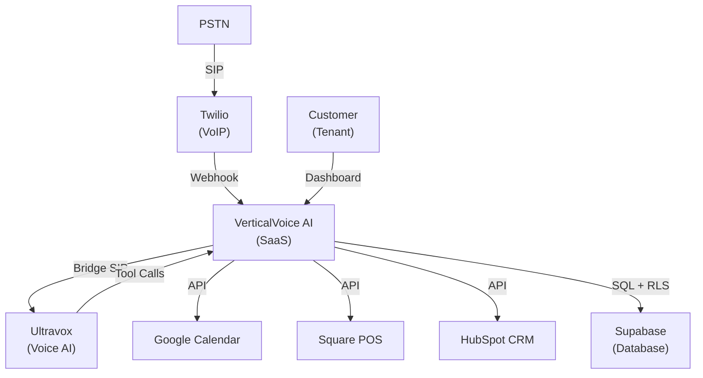
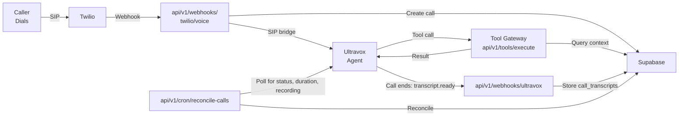
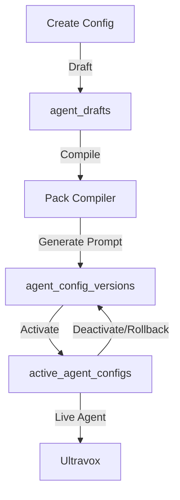
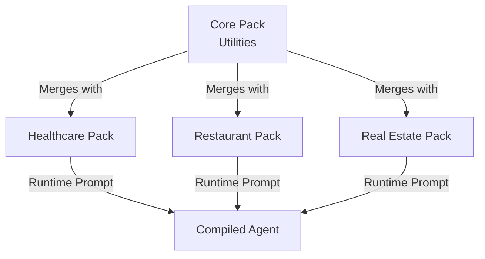

# System Design

## C4 Context Diagram



---

## Inbound Call Flow



The Ultravox webhook receives the transcript in the `transcript.ready` event payload and writes it to `call_transcripts`; it does not call back out to Ultravox to fetch it. A separate scheduled route, `api/v1/cron/reconcile-calls`, polls Ultravox to backfill call status, duration, and recording references for calls whose webhooks were missed.

---

## Agent Lifecycle



---

## Core Data Model

**Key tables** (of 91 total):

| Table | Purpose |
|---|---|
| tenants | Organization boundary |
| users | Team members + auth |
| agent_configs | Agent definition |
| agent_config_versions | Version history |
| active_agent_configs | Live version + RLS gate |
| calls | Call record (inbound/outbound) |
| call_events | State transitions |
| call_transcripts | Conversation text |
| call_recordings | Audio reference |
| call_outcomes | Resolved/escalated/abandoned |
| call_tool_runs | Tool execution log |
| knowledge_sources | Integration source |
| knowledge_documents | Parsed documents |
| contacts | Tenant contacts |
| audit_events | All data access |

**RLS Strategy**: Every table has `tenant_id` + RLS policy. Queries filtered at SQL level.

---

## Industry Pack Architecture



Each pack contributes intents, tools, and compliance policies. Compiler merges at runtime.

---

## Multi-Tenant Isolation: RLS Example

```
Table: calls

Columns: id, tenant_id, ...

RLS Policy:
  ENABLE RLS ON calls;
  CREATE POLICY tenant_isolation ON calls
    USING (tenant_id = auth.jwt.sub);
```

Query `SELECT * FROM calls` automatically returns only rows where `tenant_id = authenticated_user.tenant_id`.

---

## Tool Execution Contract

1. Agent generates tool call: `{ toolId: "book_appointment", parameters: {...} }`
2. Tool gateway receives POST to `api/v1/tools/execute/[toolId]`
3. Zod schema validates parameters
4. Service function executes (reads calendar, updates database)
5. Result returned to agent as text

All tool calls are type-checked before execution.

---

## Compliance Pipeline

```
Inbound Call
  ├─ PII/PHI tagging
  ├─ Fair-housing check (real estate)
  ├─ Recording consent verify
  └─ Transcript redaction
→ Store in database
→ Audit log
```

Policies are applied in sequence; violations are logged.

---

## Key Design Decisions

| Decision | Rationale | Trade-off |
|---|---|---|
| Cascaded STT→NLU→TTS | Easier integration with tools | Accumulated latency across stages (magnitude not measured) |
| Provider adapters | Pluggable voice/telephony | Code complexity |
| Industry packs | Shared infrastructure + isolated logic | Feature creep risk |
| RLS for tenancy | Data-layer isolation | Query latency |
| Versioned agent configs | Safe rollback + audit trail | Complex lifecycle |

---

## Scaling Notes

- **Horizontal**: Multiple app instances + load balancer
- **Database**: Supabase handles scaling (replicas, connection pooling)
- **Bottlenecks**: RLS evaluation, transcript async fetch, LLM latency
- **Future optimizations**: Query caching, async job queue, database indexing

---

## Conclusion

Multi-tenant isolation via RLS, modular provider architecture, and pluggable industry packs. Suitable for B2B SaaS pilot; requires caching and async processing before scaling to 10,000+ concurrent calls.
