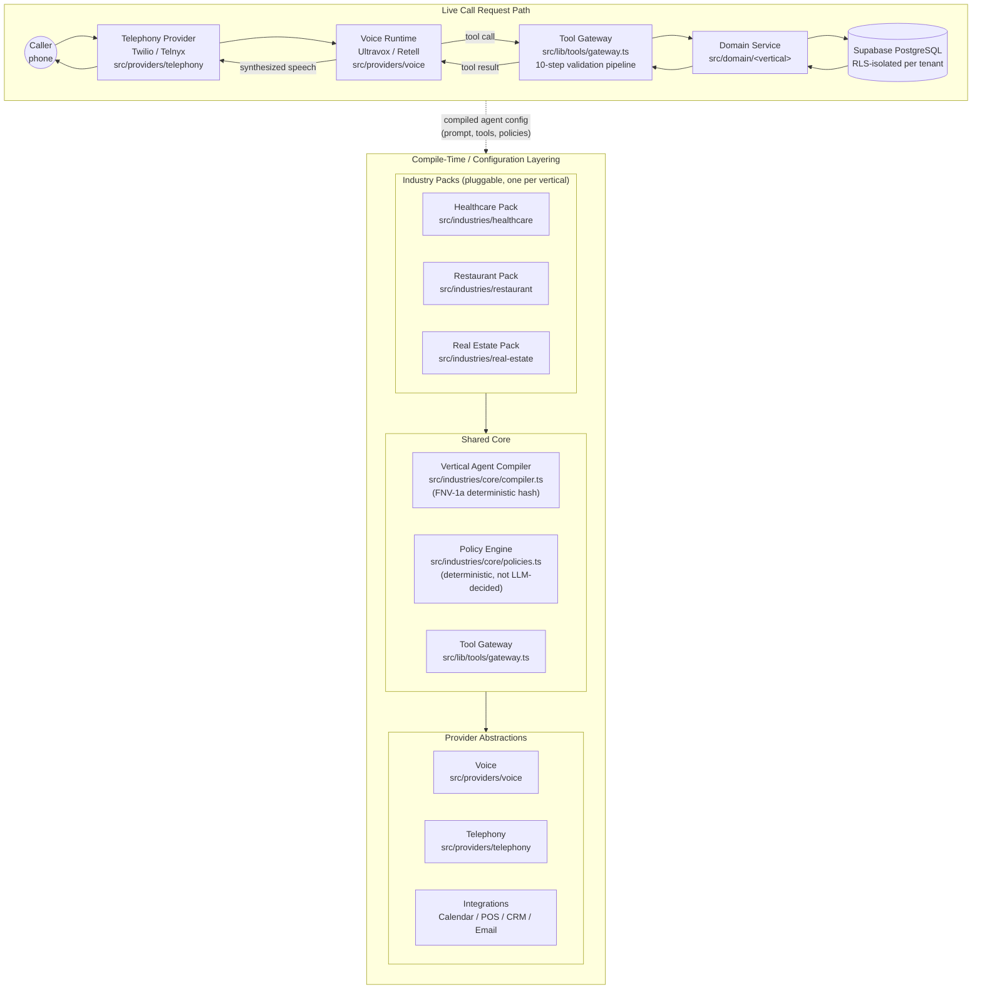

# VerticalVoice AI — System Architecture

This diagram shows how a phone call actually moves through the platform, and
how the codebase is layered so that three very different businesses
(healthcare, restaurant, real estate) can be served by one system instead of
three separate apps.

The top half is the **request path**: a caller dials in, the call is handled
by a telephony provider, a voice runtime turns speech into a conversation, the
agent invokes tools through a gateway, and a domain service reads/writes the
tenant's data in Supabase. The bottom half is the **compile-time layering**:
a single Shared Core (the Vertical Agent Compiler, the deterministic policy
engine, and the tool gateway) sits between the three pluggable Industry Packs
and the provider abstractions for Voice, Telephony, and third-party
Integrations. No vertical talks to a provider directly — everything routes
through the shared core, which is what keeps HIPAA logic, Fair Housing logic,
and allergen logic contained inside their own pack instead of leaking into
shared code.

**How to read this**: the compiler takes a `TenantConfig` plus the tenant's
active `IndustryPack` and produces a `CompiledAgentConfig` — a deterministic,
hashable bundle of system prompt, active intents, active tools, active
policies, and voice/call settings. That compiled config is what actually
drives the live call path at the top of the diagram. Because every vertical
implements the same `IndustryPack` interface (`src/industries/core/industry-pack.ts`),
the compiler, the policy engine, and the tool gateway never need to know
whether they're talking to a medical clinic, a restaurant, or a real estate
brokerage — the vertical-specific behavior lives entirely inside the pack.
