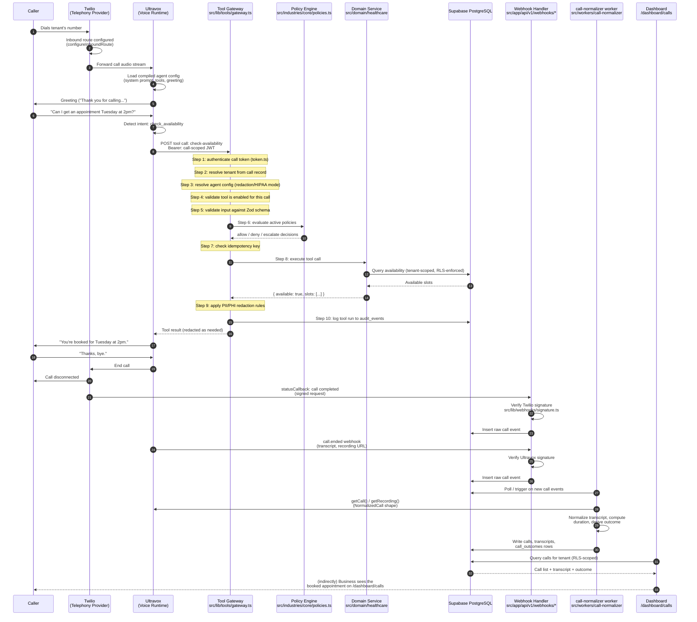

# VerticalVoice AI — End-to-End Call Data Flow

This sequence diagram traces one real inbound call from the moment it hits
Twilio to the moment the dashboard reflects it. It uses `check-availability`
as the example tool call (registered in `src/lib/tools/gateway.ts`), and shows
the full round trip through the 10-step tool gateway, the webhook that fires
when the call ends, and the background worker (`src/workers/call-normalizer`)
that turns raw provider data into the transcript/summary/outcome the
dashboard displays. Every arrow in this diagram corresponds to a real file in
the repo — nothing here is a hypothetical integration.

The key takeaway for judges: the voice runtime never talks to the database
directly. Every tool invocation is forced through the gateway's 10-step
pipeline — auth, tenant resolution, config resolution, enablement check,
schema validation, policy evaluation, idempotency, execution, redaction, and
audit logging — and every call's post-hoc data (transcript, summary, outcome)
is derived by the `call-normalizer` worker from provider webhooks rather than
trusted verbatim from the voice runtime, so a single compromised or buggy
webhook cannot corrupt tenant data without passing through the same
validation and RLS boundaries as a live call.
